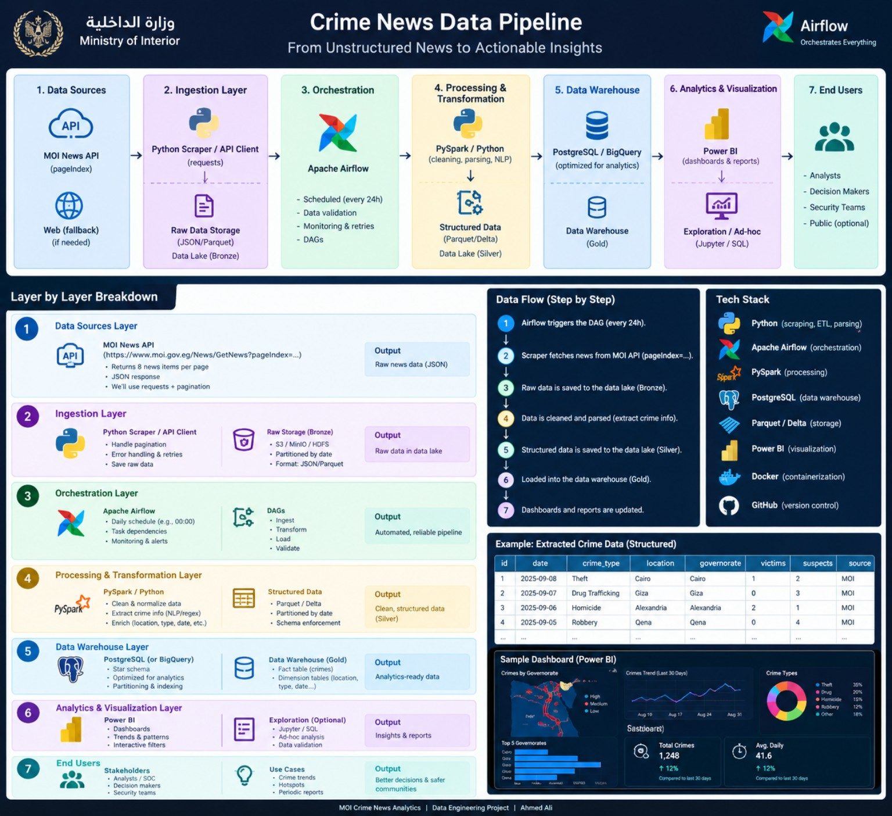
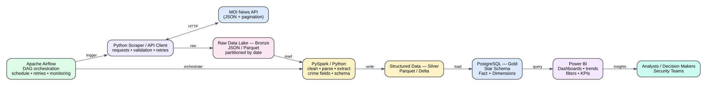
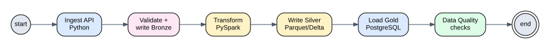
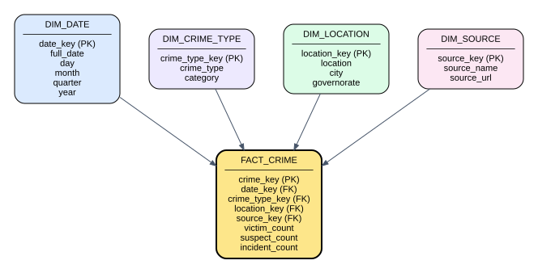
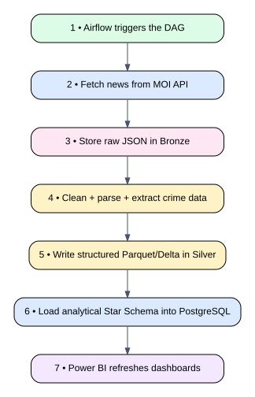
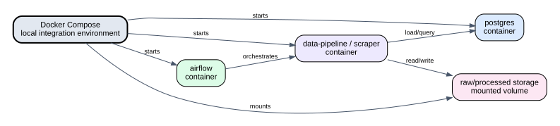

# 🇪🇬 MOI Crime News Data Pipeline

> **From Unstructured Crime News → Reliable Data → Analytical Insights**

A production-minded Data Engineering project that ingests crime news
from the **Ministry of Interior (MOI) News API**, stores raw data,
transforms it into structured analytical data, loads it into
**PostgreSQL using a Star Schema**, and exposes the results through
**Power BI**.

The architecture below is the project's **North Star**: every
implementation decision should fit this design unless the team
explicitly agrees to change the architecture.

------------------------------------------------------------------------

## 🧭 North Star Architecture



### System Architecture



### Core idea

``` text
MOI News API
     │
     ▼
Python Ingestion
     │
     ▼
Bronze — Raw Data
     │
     ▼
PySpark / Python Transformation
     │
     ▼
Silver — Structured Data
     │
     ▼
PostgreSQL — Gold / Star Schema
     │
     ▼
Power BI
     │
     ▼
Analysts & Decision Makers
```

**Important:** NGINX is intentionally **not part of this architecture**.
The pipeline does not need a reverse proxy to solve its core
data-engineering problem.

------------------------------------------------------------------------

# 🏗️ Architecture Layers

## 1. Data Source Layer

### Ministry of Interior News API

The primary source is the MOI news API.

**Responsibilities** - Fetch news pages - Handle pagination - Receive
JSON responses - Preserve source information - Detect failed/empty
responses

**Output**

``` text
Raw JSON
```

The source should be treated as **external and unreliable**: network
failures, malformed responses, duplicated records, schema changes, and
missing fields are all possible.

------------------------------------------------------------------------

## 2. Ingestion Layer

### Python Scraper / API Client

Python is responsible for interacting with the API.

``` text
API
 │
 ├── requests
 ├── pagination
 ├── timeout handling
 ├── retries
 ├── response validation
 └── raw-data serialization
```

The ingestion service should **not perform heavy analytical
transformations**.

Its job is to acquire and preserve data reliably.

### Bronze Storage

The first storage layer keeps the data close to its original form.

``` text
Bronze
├── raw JSON
├── ingestion metadata
├── source information
└── partitioned by date
```

Why?

Because transforming data immediately and throwing away the original
payload makes debugging much harder.

If a transformation produces a wrong result, Bronze gives us the
original input needed to reproduce the problem.

------------------------------------------------------------------------

# 3. Orchestration Layer

## Apache Airflow



Airflow is the **orchestrator**, not the processing engine.

It controls **when** tasks run and **in what order** they run.

### Example DAG

``` text
Start
  ↓
Ingest API
  ↓
Validate + Bronze
  ↓
Transform
  ↓
Silver
  ↓
PostgreSQL Gold
  ↓
Data Quality Checks
  ↓
End
```

### Airflow responsibilities

-   Scheduling
-   Task dependencies
-   Retries
-   Failure handling
-   Monitoring
-   Logging
-   Data pipeline coordination

### Why Airflow?

Because the pipeline is not simply:

``` python
run_everything()
```

It is a sequence of dependent data operations that should be observable
and recoverable.

------------------------------------------------------------------------

# 4. Processing & Transformation Layer

## PySpark + Python

This layer converts raw news into structured crime data.

### Processing responsibilities

-   Cleaning
-   Parsing
-   Normalization
-   Crime extraction
-   Date extraction
-   Location extraction
-   Crime-type classification/extraction
-   Victim/suspect extraction
-   Schema enforcement
-   Data-quality validation

Example:

``` text
Raw News
   ↓
Cleaning
   ↓
Parsing
   ↓
Crime Information Extraction
   ↓
Normalization
   ↓
Structured Record
```

### Why PySpark?

The project may start with a relatively small dataset, but the
architecture is designed around distributed processing concepts.

That said:

> **PySpark should not be used just because it is popular.**

If a transformation is trivial and Python is sufficient, Python is
perfectly acceptable. PySpark becomes valuable when the data volume or
transformation workload justifies distributed processing.

------------------------------------------------------------------------

# 5. Silver Data Layer

The Silver layer contains **clean, structured, validated data**.

Recommended format:

``` text
Parquet
```

or, if the project later requires transactional table behavior:

``` text
Delta
```

### Bronze vs Silver

  Layer    Purpose                    Example
  -------- -------------------------- ------------------------
  Bronze   Preserve raw source data   Raw JSON
  Silver   Clean + structured data    Parquet
  Gold     Analytical model           PostgreSQL Star Schema

This separation prevents the analytical database from becoming the place
where all cleaning and recovery logic happens.

------------------------------------------------------------------------

# ⭐ 6. PostgreSQL --- Gold Data Warehouse

PostgreSQL is the analytical serving layer.

The Gold layer uses a **Star Schema**.



## Why Star Schema?

Because Power BI and analytical queries frequently ask questions such
as:

-   How many crimes happened?
-   Which governorate has the most incidents?
-   What crime type is increasing?
-   How many incidents happened this month?
-   What is the daily crime trend?
-   Which locations have the highest activity?

A Star Schema makes these analytical queries straightforward.

------------------------------------------------------------------------

# ⭐ Star Schema Design

## Fact Table

### `fact_crime`

The fact table represents the **grain of the model**.

> **One row = one crime incident/news-derived crime record.**

Example:

  Column             Meaning
  ------------------ -----------------------
  `crime_key`        Surrogate primary key
  `date_key`         FK to date dimension
  `crime_type_key`   FK to crime type
  `location_key`     FK to location
  `source_key`       FK to source
  `victim_count`     Number of victims
  `suspect_count`    Number of suspects
  `incident_count`   Usually `1` per row

The most important design decision is the **grain**.

If the grain is unclear, the warehouse will eventually produce incorrect
aggregations.

------------------------------------------------------------------------

## Dimension Tables

### `dim_date`

Contains calendar information.

``` text
date_key
full_date
day
month
quarter
year
```

This allows Power BI to perform time-based analysis without repeatedly
calculating calendar attributes.

### `dim_crime_type`

``` text
crime_type_key
crime_type
category
```

Examples:

``` text
Theft
Robbery
Homicide
Drug Trafficking
...
```

### `dim_location`

``` text
location_key
location
city
governorate
```

This supports geographical analysis.

### `dim_source`

``` text
source_key
source_name
source_url
```

This preserves lineage back to the original source.

------------------------------------------------------------------------

# 🔄 Complete Data Flow



### Step-by-step

**1. Airflow triggers the DAG**

↓

**2. Python requests the MOI API**

↓

**3. Raw responses are written to Bronze**

↓

**4. PySpark/Python cleans and parses the data**

↓

**5. Structured records are written to Silver**

↓

**6. Silver data is loaded into PostgreSQL Gold**

↓

**7. Power BI reads the Gold layer**

↓

**8. Analysts explore dashboards and trends**

------------------------------------------------------------------------

# 🐳 Docker Architecture



Docker is used to make the development environment reproducible.

## Main containerized components

``` text
Docker Compose
│
├── Airflow
│
├── Data Pipeline / Scraper
│
└── PostgreSQL
```

Storage can be mounted through Docker volumes or connected to an
object-storage implementation depending on the final deployment.

### Important team rule

Each service should own its own environment definition.

For example:

``` text
service/
├── Dockerfile
├── requirements.txt
└── src/
```

The final integration is handled through:

``` text
docker-compose.yml
```

This means a developer can work on a service without needing to
understand every other service's internal code.

------------------------------------------------------------------------

# 🧩 Repository Structure

Recommended structure:

``` text
crime-news-data-pipeline/
│
├── dags/
│   └── crime_news_pipeline.py
│
├── services/
│   └── ingestion/
│       ├── Dockerfile
│       ├── requirements.txt
│       └── src/
│
├── processing/
│   ├── jobs/
│   ├── transformations/
│   └── schemas/
│
├── warehouse/
│   ├── ddl/
│   ├── dimensions/
│   └── facts/
│
├── storage/
│   ├── bronze/
│   └── silver/
│
├── infrastructure/
│   └── postgres/
│
├── docs/
│   └── images/
│
├── docker-compose.yml
├── .env.example
└── README.md
```

The exact structure can evolve, but responsibilities should remain
separated.

------------------------------------------------------------------------

# 🔌 Component Responsibilities

  -----------------------------------------------------------------------
  Component               Responsibility          Should NOT do
  ----------------------- ----------------------- -----------------------
  MOI API                 Provide source data     Transformation

  Python Ingestion        Fetch + validate +      Analytics
                          persist raw data        

  Bronze                  Preserve raw data       Business reporting

  Airflow                 Orchestrate tasks       Heavy transformation

  PySpark/Python          Transform data          Dashboarding

  Silver                  Store clean structured  User-facing analytics
                          data                    

  PostgreSQL              Serve Gold analytical   Raw ingestion dumping
                          model                   

  Star Schema             Organize analytical     Operational
                          entities/measures       transactions

  Power BI                Visualization +         Pipeline orchestration
                          analysis                

  Docker                  Reproducible            Data transformation
                          environments            logic
  -----------------------------------------------------------------------

------------------------------------------------------------------------

# 📊 Power BI Analytics

Power BI sits **above PostgreSQL Gold**.

``` text
PostgreSQL
    │
    │ SQL
    ▼
Power BI
    │
    ├── Crime KPIs
    ├── Crime trends
    ├── Governorate comparison
    ├── Crime-type distribution
    ├── Daily / monthly analysis
    └── Interactive filtering
```

### Important architectural rule

Power BI should primarily consume the **Gold analytical model**, not raw
Bronze data.

That keeps business reporting separated from ingestion and
transformation logic.

------------------------------------------------------------------------

# 🛡️ Data Quality

A reliable pipeline needs more than successful execution.

We should validate:

``` text
✓ Required fields exist
✓ Dates are valid
✓ Crime type is not unexpectedly empty
✓ Location is normalized
✓ Duplicate records are detected
✓ Victim/suspect counts are valid
✓ Source information is preserved
✓ Record counts are reasonable
```

Airflow should be able to fail a run when critical quality checks fail.

------------------------------------------------------------------------

# 🔁 Reliability Strategy

The pipeline should assume failure.

### API failure

``` text
Request
  ↓
Timeout / Error
  ↓
Retry
  ↓
Success → Continue
  ↓
Repeated failure → Fail task + alert
```

### Processing failure

Bronze data remains available, so the transformation can be rerun
without necessarily requesting the source again.

This is one of the main reasons the Medallion-style separation is
valuable.

------------------------------------------------------------------------

# 🔐 Configuration & Secrets

Secrets should never be hardcoded.

Use environment variables:

``` text
MOI_API_URL=
POSTGRES_HOST=
POSTGRES_PORT=
POSTGRES_DB=
POSTGRES_USER=
POSTGRES_PASSWORD=
```

Commit:

``` text
.env.example
```

Never commit:

``` text
.env
```

------------------------------------------------------------------------

# 🌿 Git & Team Workflow

Recommended workflow:

``` text
main
 │
 ├── feature/ingestion
 ├── feature/airflow
 ├── feature/processing
 ├── feature/warehouse
 └── feature/powerbi
```

Each developer works primarily on their assigned component.

Before integration:

``` text
Code
 ↓
Local Test
 ↓
Docker Test
 ↓
Pull Request
 ↓
Review
 ↓
Merge
 ↓
Integration Test
```

------------------------------------------------------------------------

# 🧠 Architecture Principles

### 1. Preserve raw data

Never make Bronze disposable just because Silver exists.

### 2. Define the grain before designing the fact table

The statement:

> **One row represents what?**

must have a precise answer.

### 3. Airflow orchestrates

Airflow should coordinate the pipeline rather than becoming a giant
Python script.

### 4. PostgreSQL is the Gold analytical serving layer

Power BI gets a clean analytical model instead of raw data.

### 5. Docker makes environments reproducible

A developer should be able to start the stack without manually
reproducing every dependency.

### 6. Don't over-engineer

We deliberately removed NGINX.

We also should not introduce Kafka, Kubernetes, Redis, or another
infrastructure component unless the project actually has a requirement
that justifies it.

### 7. Data lineage matters

Every analytical record should ultimately be traceable back toward its
source.

------------------------------------------------------------------------

# 🗺️ North Star --- One Page

``` text
                         ┌──────────────────────┐
                         │    MOI NEWS API      │
                         └──────────┬───────────┘
                                    │
                                    ▼
                         ┌──────────────────────┐
                         │   PYTHON INGESTION   │
                         │ requests • retries   │
                         └──────────┬───────────┘
                                    │
                                    ▼
                         ┌──────────────────────┐
                         │   BRONZE / RAW       │
                         │       JSON           │
                         └──────────┬───────────┘
                                    │
                         ┌──────────▼───────────┐
                         │       AIRFLOW        │
                         │    ORCHESTRATION     │
                         └──────────┬───────────┘
                                    │
                                    ▼
                         ┌──────────────────────┐
                         │   PYSPARK / PYTHON   │
                         │ CLEAN • PARSE • ETL  │
                         └──────────┬───────────┘
                                    │
                                    ▼
                         ┌──────────────────────┐
                         │    SILVER / PARQUET  │
                         │ STRUCTURED DATA      │
                         └──────────┬───────────┘
                                    │
                                    ▼
                    ┌───────────────────────────────┐
                    │       POSTGRESQL GOLD         │
                    │                               │
                    │       ⭐ STAR SCHEMA          │
                    │                               │
                    │  FACT_CRIME + DIMENSIONS     │
                    └───────────────┬───────────────┘
                                    │
                                    ▼
                         ┌──────────────────────┐
                         │       POWER BI       │
                         │ ANALYSIS • DASHBOARD │
                         └──────────┬───────────┘
                                    │
                                    ▼
                         ┌──────────────────────┐
                         │       END USERS      │
                         │ Analysts / Security  │
                         └──────────────────────┘
```

------------------------------------------------------------------------

## 🚦 Architecture Change Rule

This document is the project's **North Star**, not a prison.

If the team wants to introduce a new component or change an existing
one, answer three questions first:

1.  **What problem does it solve?**
2.  **Why can't the existing architecture solve that problem?**
3.  **What new operational complexity does it introduce?**

If those answers are weak, don't add the technology.

------------------------------------------------------------------------

## 🛠️ Tech Stack

  Technology        Role
  ----------------- ---------------------------------
  Python            Ingestion + processing
  Apache Airflow    Orchestration
  PySpark           Distributed transformation
  Parquet / Delta   Data Lake storage
  PostgreSQL        Gold analytical warehouse
  Star Schema       Dimensional modeling
  Power BI          Analytics & visualization
  Docker            Containerization
  GitHub            Version control & collaboration

------------------------------------------------------------------------

## 📌 Project Status

> Architecture baseline --- **North Star**

Implementation will proceed layer-by-layer:

``` text
1. Repository + Git workflow
2. Docker environment
3. MOI API ingestion
4. Bronze storage
5. Airflow DAG
6. Transformation / PySpark
7. Silver storage
8. PostgreSQL Star Schema
9. Data loading + quality checks
10. Power BI dashboards
11. End-to-end integration
```

------------------------------------------------------------------------

## 👥 Team

**Data Engineering Project --- Ministry of Interior Crime News
Analytics**

Architecture maintained by the project team.
